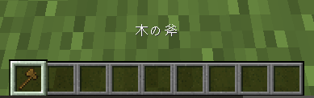
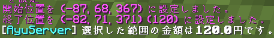
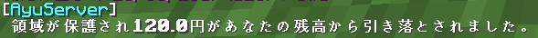

# Hogo
## 説明

| コマンド | 内容 |
| ---- | ---- |
| `/hogo help` | ヘルプを表示します。 |
| `/hogo price` | 選択範囲の金額を表示します。 |
| `/hogo claim` (保護名) | 選択範囲を保護します。 |
| `/hogo delete` (保護名) | 指定した土地を削除します。 |

## 保護の仕方
まず、保護をするには範囲を指定します。  
//wand と実行して木の斧を入手します。  
その斧を使用して保護したい範囲の始点を左クリックして次に終点を右クリックしてください。  

もしここで今指定した土地がいくらかかるのか確認したい場合は  
`/hogo price`と実行し確認することができます。

そして値段を確認したら
`/hogo claim (保護名)` を入力してコマンド実行するとお金が引き落とされ、  
土地を保護することができます。

このプラグインはWorldGuardと連携されているので  
土地にメンバーを追加したい時などは`WorldGuard メンバー追加`などで  
調べて出てくる方法をお試しください。

## 削除の方法
保護した土地を削除したい時は  
`/hogo delete (保護名)`を入力してコマンド実行することで  
土地が削除されます。

:::warning
保護にかかった金額は返金されません。
:::