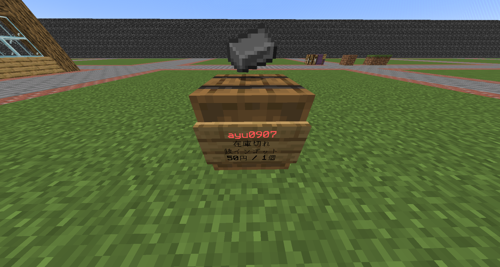

# QuickShop
## 説明
Shop鯖にてShopを作成し自動でアイテムを販売・買取することができます。
:::danger
プレイヤーショップで購入した土地でしかShopは作成できません。
:::

## Shopの作成方法
まず、Shopになる樽をプレイヤーショップの土地に設置します。  
そして売りたいアイテムを持って樽を殴ります。  
するといくらにしたいか聞かれるのでチャットに価格を送信します。  
送信し、Shopが完成するとこんな見た目になります。  
  
この状態だと在庫がなく販売できないので、樽の中に在庫を入れてあげます。  
そしたら売れます。

## Shopを買取にする方法
Shopの樽に向かって`/qs buy`と実行すると買取になります。

## Shopの価格を変えたい方法
Shopの樽に向かって`/qs price (金額)`と実行すると買取になります。
:::warning
Shopの価格を変更するときは手数料として50円が引かれます。
:::

## Shopを削除する方法
Shopの樽に向かって`/qs remove`を2回実行します。
そうすると削除されます。しっかり中の在庫などを回収するようにしましょう。  