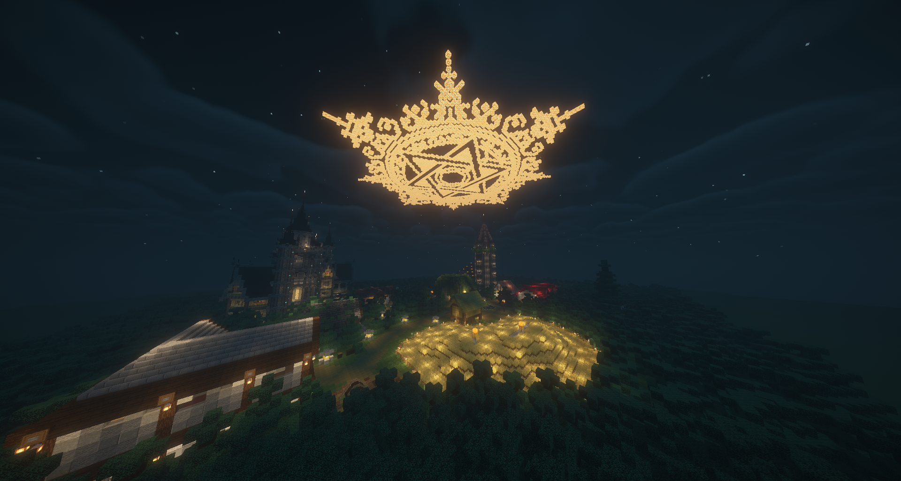
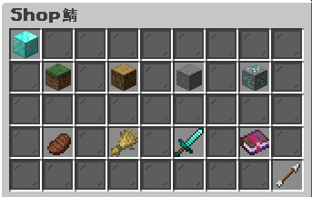
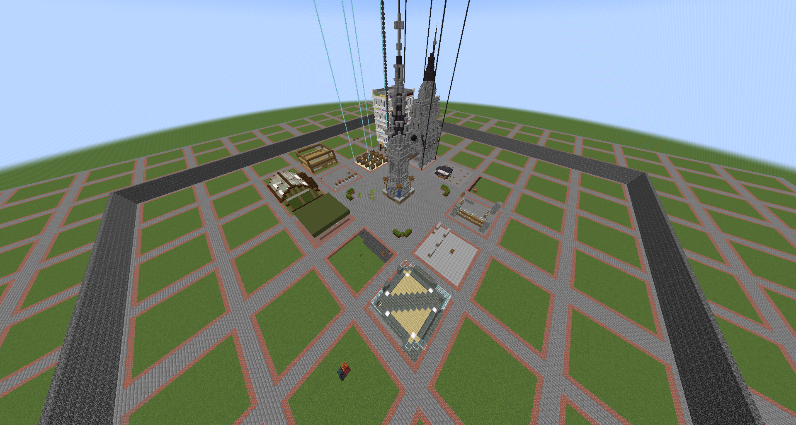
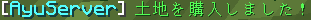
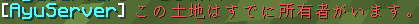

# Shop鯖

## 説明

Shop鯖ではプレイヤーShopでアイテムを購入したり運営Shopでアイテムを売却することができます

## 運営Shop

運営Shopでは基本的に売却が可能です。  
`/menu`と実行し運営Shopを選択すると、各Shopへテレポートすることが可能です。  

## プレイヤーショップ

参加者の皆様自らShopを開くことが可能です。  
具体的なShopの開店方法は下の方にあります。  

2024/11/10現在のプレイヤーショップ

# プレイヤーショップ - 開店
:::info
2024/11/10現在の土地の価格は10万円です。
:::
まずは土地を購入します。購入したい土地の上に立って次のコマンドを実行します。  
`/land buy`  
  
と出てブロックが置けるようになれば購入成功です。  
  
などと出ればすでに購入された土地ですのでほかの土地を購入するようにしましょう。